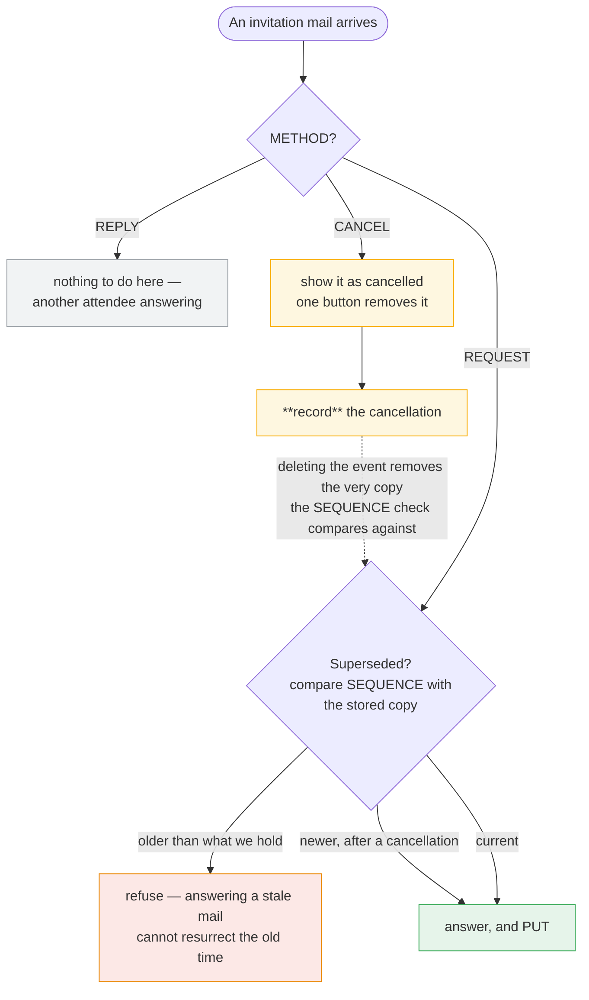

# Meeting Invitations for SnappyMail

Accept, tentatively accept or decline a meeting invitation from the message
view, and have the answer stored in your CalDAV calendar.

SnappyMail can *display* an `.ics` attachment (the `ics-viewer` plugin does it
well) but nothing can act on one: an invitation has to be re-entered into the
calendar by hand. This plugin adds the missing step.

## How it works

When a message carries a `text/calendar` part whose method is `REQUEST`, the
plugin shows the meeting summary, organiser, time and location, with three
buttons. Choosing one sets your `ATTENDEE;PARTSTAT` and `PUT`s the event into
your calendar.

**The reply to the organiser is not built by this plugin.** Under
[RFC 6638](https://www.rfc-editor.org/rfc/rfc6638) the CalDAV server owns
scheduling: storing the event in your own calendar with your `PARTSTAT` set
makes the server generate and deliver the `METHOD:REPLY` itself and mark the
`ORGANIZER` with `SCHEDULE-STATUS`. That keeps this plugin free of iTIP
construction and of any SMTP path — no reply is composed, sent or queued here.

```mermaid
sequenceDiagram
    autonumber
    actor U as You
    participant M as Message view<br/>(this plugin)
    participant D as CalDAV server<br/>(Cyrus)
    actor O as Organiser
    Note over M: a text/calendar part<br/>with METHOD:REQUEST
    M->>M: match the invitation against your<br/>account address and your identities
    M->>D: read the copy already in your calendar
    D-->>M: SEQUENCE of what you hold
    alt the mail is superseded
        M--xU: refuse to answer — a reschedule<br/>happened after this mail
    else current
        U->>M: Accept · Tentative · Decline
        M->>D: PUT the event with ATTENDEE;PARTSTAT set
        D->>O: METHOD:REPLY — built and sent by the SERVER
        D-->>M: SCHEDULE-STATUS=1.1 on the ORGANIZER
    end
```

Verified against [Cyrus IMAP](https://www.cyrusimap.org/): a `PUT` carrying
`PARTSTAT=ACCEPTED` comes back with `SCHEDULE-STATUS=1.1` on the organiser,
meaning the reply was sent.

The arrow that is *not* here is the point of the design: **no reply is composed,
sent or queued by this plugin**, and there is no SMTP path in it at all. Storing
the event with your `PARTSTAT` set is what makes the server speak.

Requires a CalDAV server with scheduling enabled. On Cyrus that is
`caldav_allowscheduling` plus `imipnotifier` for delivery by mail.

## Configuration

Admin → Plugins → invitations:

| Setting | Example |
| --- | --- |
| CalDAV URL template | `https://dav.example.com/dav/calendars/user/{user}/Default/` |
| DAV default domain | `example.com` — addresses in this domain use the local part only; leave empty to always use the full address |
| Verify the DAV server certificate | on |

`{user}`, `{email}`, `{login}` and `{domain}` are substituted per account.
Nothing is hardcoded; with no template configured the plugin declines to act
rather than guess a URL.

**Left empty, the URL template and default domain are borrowed from the
`caldav` plugin's settings** if that plugin is installed. Both write to the same
calendars on the same server, and two settings pages that have to be kept
agreeing is a support call waiting to happen — a URL corrected in one place and
still wrong in the other looks exactly like a broken server. Anything set here
still wins, so an existing configuration is unaffected, and the calendar plugin
is not a requirement: if it is absent the fields are simply empty as before.

## Cancellations and updates

`METHOD:CANCEL` is recognised: the meeting is shown as cancelled and a single
button removes it from the calendar. A cancellation for an event that was never
accepted is not an error.

A cancellation is also **recorded**, because deleting the event removes the very
copy the `SEQUENCE` check compares against — without that record the original
invitation mail could still be accepted afterwards and the meeting would come
back, with a reply telling the organiser you had accepted a cancelled meeting.
A later revision is still allowed through: that is the organiser reinstating the
meeting rather than a stale mail being answered again. Records expire once the
meeting has finished.



The dotted arrow is the subtle one, and it is why cancellations are recorded
rather than simply acted on: without that record the original invitation mail
could be accepted afterwards, the meeting would come back, and the organiser
would be told you had accepted a meeting they cancelled. A **later** revision is
still let through — that is the organiser reinstating the meeting, not a stale
mail being answered twice.

`SEQUENCE` orders revisions of the same `UID`
([RFC 5545 3.8.7.4](https://www.rfc-editor.org/rfc/rfc5545#section-3.8.7.4)).
Before answering, the plugin compares the invitation against the copy already in
the calendar and refuses one that has been superseded, so answering an old mail
after a reschedule cannot resurrect the old time. A newer revision replaces the
stored copy as usual.

## Notes and limits

* `METHOD:REPLY` is another attendee answering and needs no action here.
* The invitation is matched against your account address *and* your configured
  identities, so invitations sent to an alias are recognised.
* The event is stored without `METHOD`: a calendar holds events, not scheduling
  messages.
* Event details are read from the `VEVENT` only. `VTIMEZONE` carries its own
  `DTSTART` per transition rule, so reading the first one in the document shows
  a date like 1905 instead of the meeting.
* Authentication reuses the account's own IMAP credentials.

## Authors

**Convergent Cloud Computing** — https://www.convergent.tn
Fathi Ben Nasr <fbennasr@convergent.tn>

## Licence

GNU Affero General Public License v3.0 or later (AGPL-3.0-or-later), the same
licence as SnappyMail itself, which this plugin loads into. The full text is in
[LICENSE](LICENSE).

Copyright (c) 2026 Convergent Cloud Computing.

Releases up to and including v1.2.0 were published under the MIT licence. That
grant is irrevocable for those copies: anyone who obtained the plugin under MIT
keeps it under MIT.
